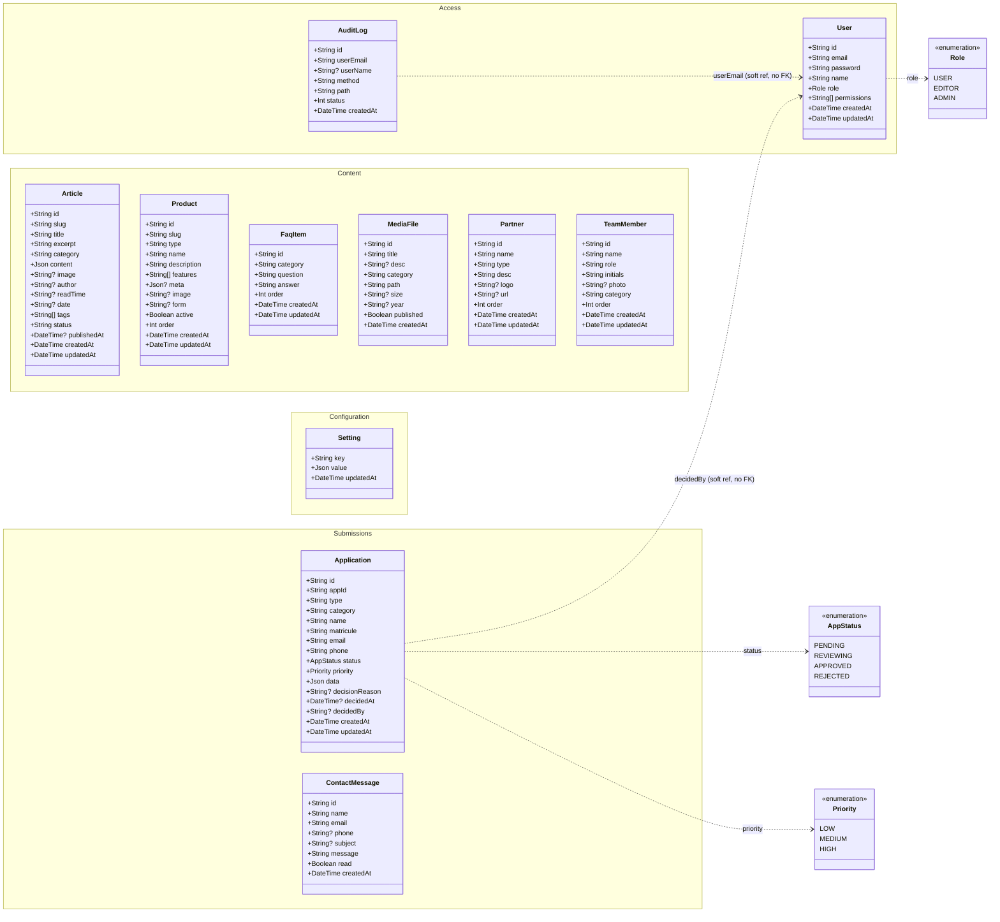

# MA2E Connect — Domain Class Diagram

> UML class diagram of the application domain model.
> **Single source of truth:** `backend/prisma/schema.prisma` (Prisma + PostgreSQL).
> Renders natively on GitHub. Exported images: [`docs/class-diagram.svg`](docs/class-diagram.svg) · [`docs/class-diagram.png`](docs/class-diagram.png).

## Legend & constraints

`Type?` = optional (nullable) · `Type[]` = array (list) · `..>` = dependency.

**Important — no foreign keys.** The Prisma schema defines **no relations** between models;
every table is independent. The two `..>` links to `User` are **soft references by value**
(an email string), *not* enforced database foreign keys:

| From | Field | Points to | Enforced? |
|------|-------|-----------|-----------|
| `AuditLog` | `userEmail` | `User.email` | No (value only) |
| `Application` | `decidedBy` | `User.email` (admin who decided) | No (value only) |

`Article.author` is a free-text label, not a link to `User`.

### Primary keys & uniqueness
| Model | Primary key | Unique constraint(s) |
|-------|-------------|----------------------|
| `User` | `id` | `email` |
| `Application` | `id` | `appId` |
| `Article` | `id` | `slug` |
| `Product` | `id` | composite `(type, slug)` |
| `Setting` | `key` | — (key is the PK) |
| `MediaFile`, `FaqItem`, `Partner`, `TeamMember`, `ContactMessage`, `AuditLog` | `id` | — |

### Defaults
- `User.role` = `USER` · `Application.status` = `PENDING` · `Application.priority` = `MEDIUM`
- `Product.active` = `true` · `MediaFile.published` = `true` · `ContactMessage.read` = `false`
- `order` = `0` (Product, FaqItem, Partner, TeamMember) · `Article.status` = `"draft"` (`"draft" | "published"`)
- `createdAt` = `now()` · `updatedAt` auto-updates on write (where present)
- `User.role` `ADMIN` implicitly grants all fine-grained `permissions`.

### JSON field shapes
- `Application.data` — submitted form fields + paths of the attached supporting documents.
- `Article.content` — array of blocks `{ type: "p" | "h2" | "quote" | "list", text?, items? }`.
- `Product.meta` — `{ taux, duree, montant, conditions, ... }` (rate, term, amount, conditions…).
- `Setting.value` — shape depends on `Setting.key` (e.g. `flashBanner`, `contact`, `social`, `stats`).

### Free-text enumerations (stored as `String`, validated in app code)
- `Product.type` — `epargne` | `credit` | `immobilier`
- `Partner.type` — `Tutelle` | `Partenaire institutionnel` | `Association professionnelle` | `Partenaire`
- `TeamMember.category` — governance organ (`CA`, `CC`, `CS`, `CED`) or `Direction`
