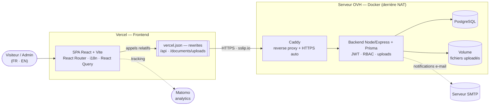
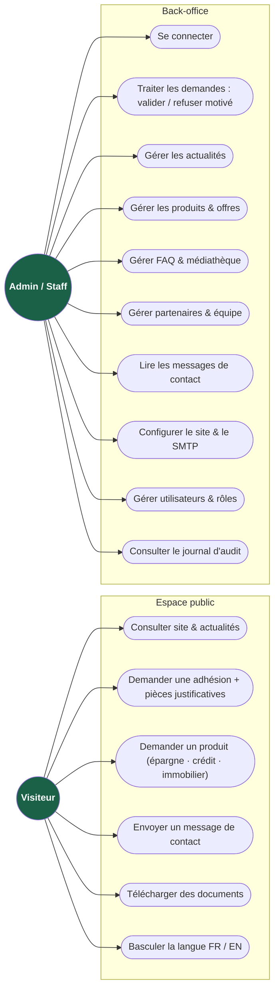
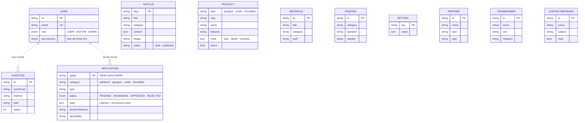
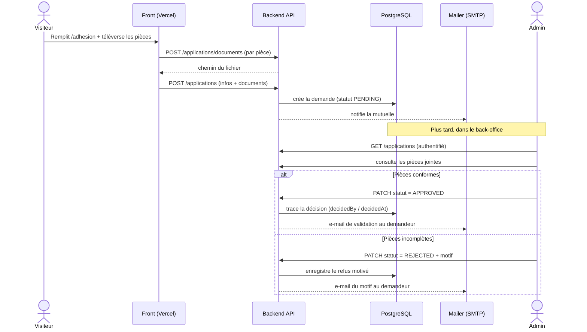
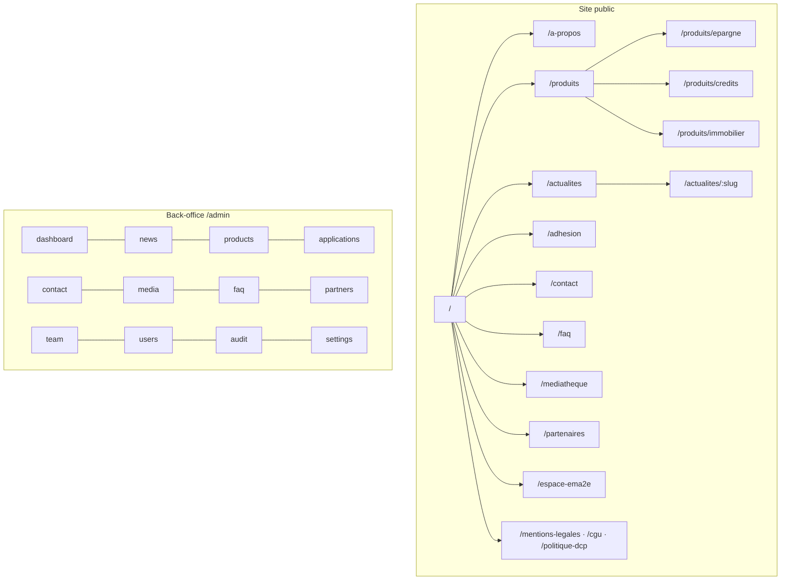
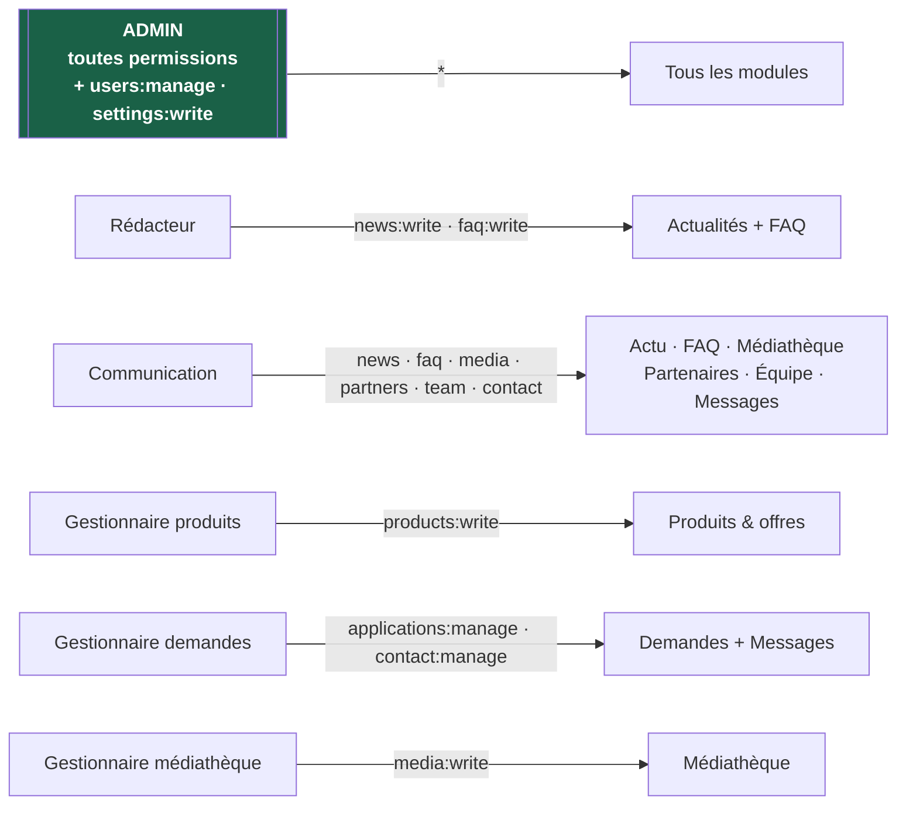

# MA2E — Architecture & diagrammes du projet

> Vue structurée du projet (diagrammes Mermaid, rendus automatiquement sur GitHub).
> Sommaire : 1) Architecture · 2) Cas d'usage · 3) Modèle de données · 4) Workflow d'adhésion ·
> 5) Plan de navigation · 6) Rôles & permissions.

---

## 1. Architecture technique

---

## 2. Cas d'usage (acteurs → fonctionnalités)

---

## 3. Modèle de données (entités principales)

> Tables CMS volontairement plates (pas de clés étrangères Prisma). Les liens ci-dessous sont **logiques**
> (par e-mail) : le journal d'audit et les décisions de demandes référencent l'utilisateur.

---

## 4. Workflow « demande d'adhésion → décision »

---

## 5. Plan de navigation

---

## 6. Rôles & permissions (profils prédéfinis)

> ADMIN possède toutes les permissions implicitement. Le menu du back-office est **adaptatif** :
> chaque profil ne voit que les modules qu'il a le droit de gérer.
