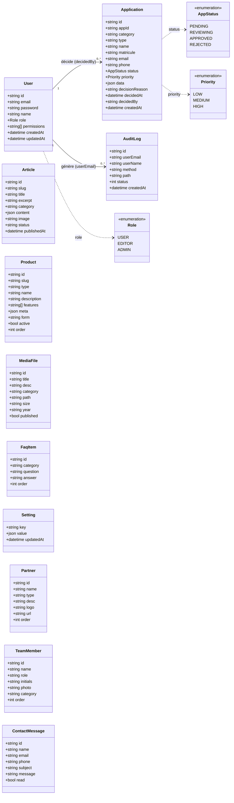
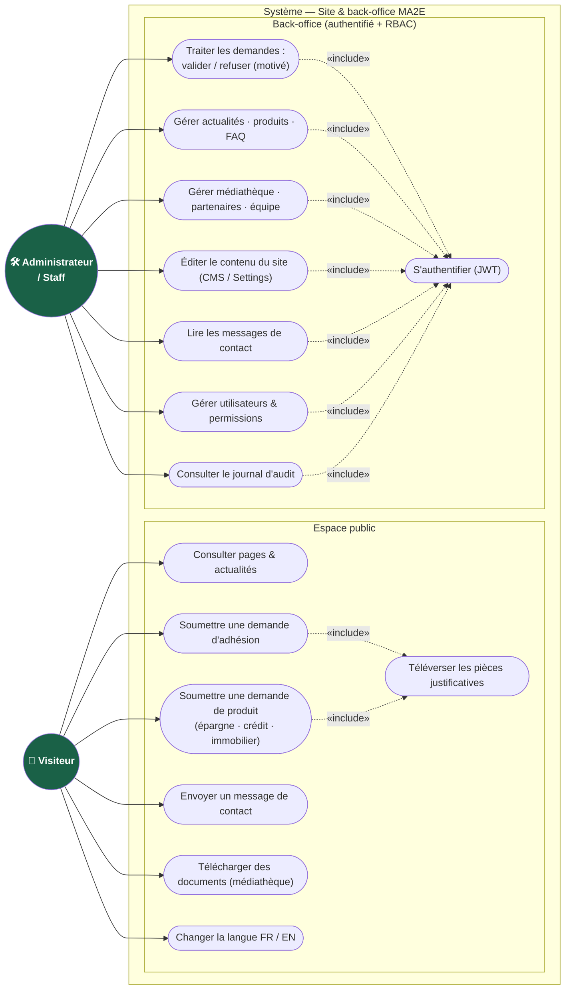
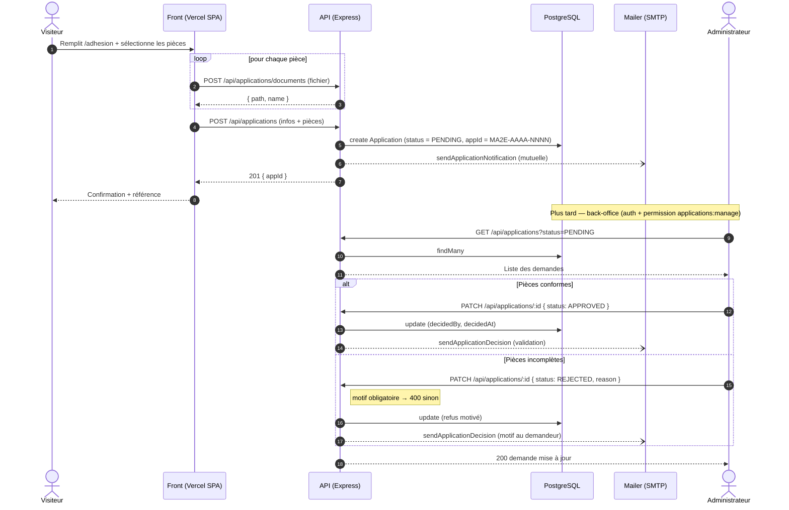
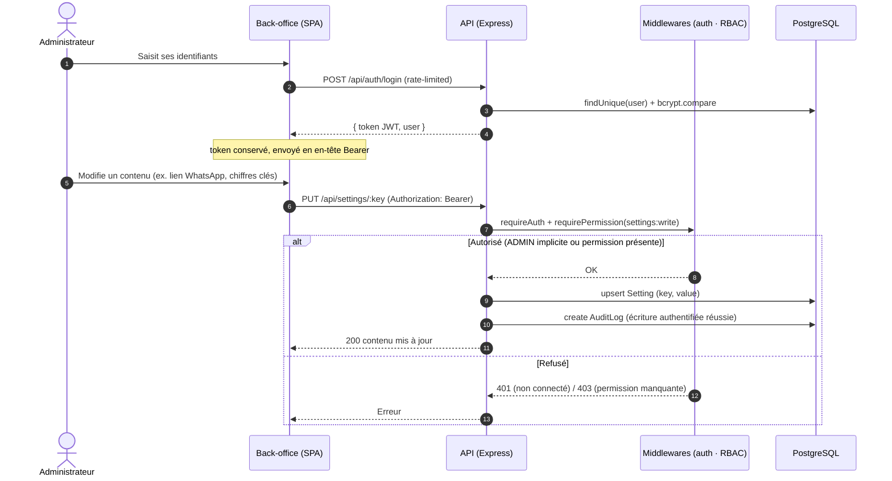

# MA2E — Diagrammes UML

> Diagrammes Mermaid (rendus automatiquement sur GitHub / VS Code avec l'extension Mermaid).
> Ancrés sur le code réel : `backend/prisma/schema.prisma`, `backend/src/lib/permissions.ts`,
> `backend/src/routes/*`, `backend/src/middleware/auth.ts`.
> Vues complémentaires (architecture, navigation, rôles) : voir [`DIAGRAMMES_MA2E.md`](./DIAGRAMMES_MA2E.md).

Sommaire : **1) Diagramme de classes · 2) Diagramme de cas d'utilisation · 3) Diagrammes de séquence**

---

## 1. Diagramme de classes

> Modèle du domaine (entités Prisma + énumérations). Les tables CMS sont volontairement **plates**
> (pas de clés étrangères) ; les associations ci-dessous sont **logiques** : une demande et une entrée
> d'audit référencent l'utilisateur par son **e-mail** (`decidedBy`, `userEmail`), pas par une FK.

---

## 2. Diagramme de cas d'utilisation

> Deux acteurs : le **Visiteur** (public, non authentifié) et l'**Administrateur / Staff**
> (back-office, authentifié — le périmètre exact dépend des permissions fines, cf. diagramme de classes
> et `PROFILES`). « include » = relation d'inclusion UML.

---

## 3. Diagrammes de séquence

### 3.a — Demande (adhésion / produit) → décision

### 3.b — Connexion admin & édition de contenu (CMS) avec audit

---

> **Note de fidélité au code.** Diagrammes générés à partir de : entités & énums de `schema.prisma` ;
> permissions de `permissions.ts` ; flux de `routes/applications.ts`, `routes/auth.ts`, `routes/settings.ts` ;
> JWT/RBAC de `middleware/auth.ts` ; journalisation de `lib/audit.ts` (toute écriture authentifiée et réussie).
