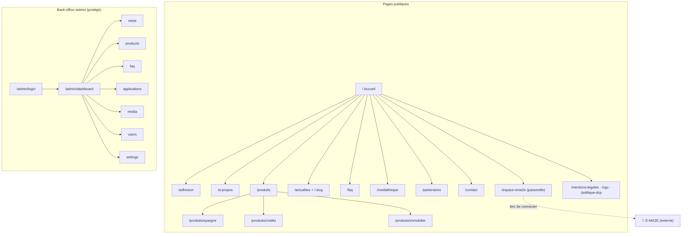
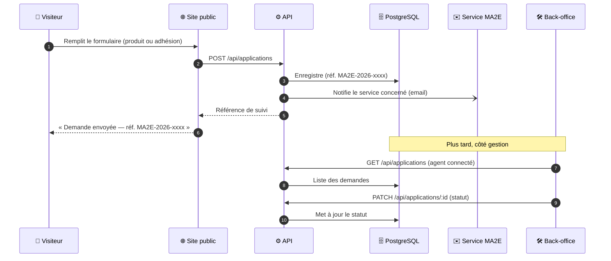
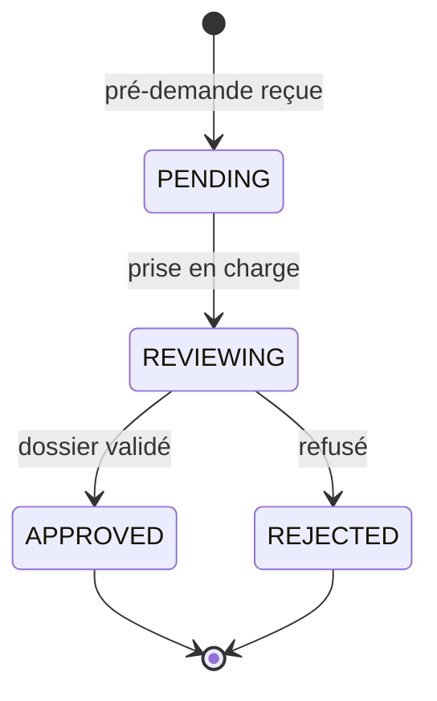
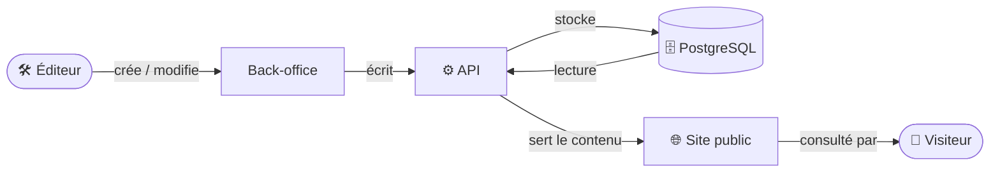
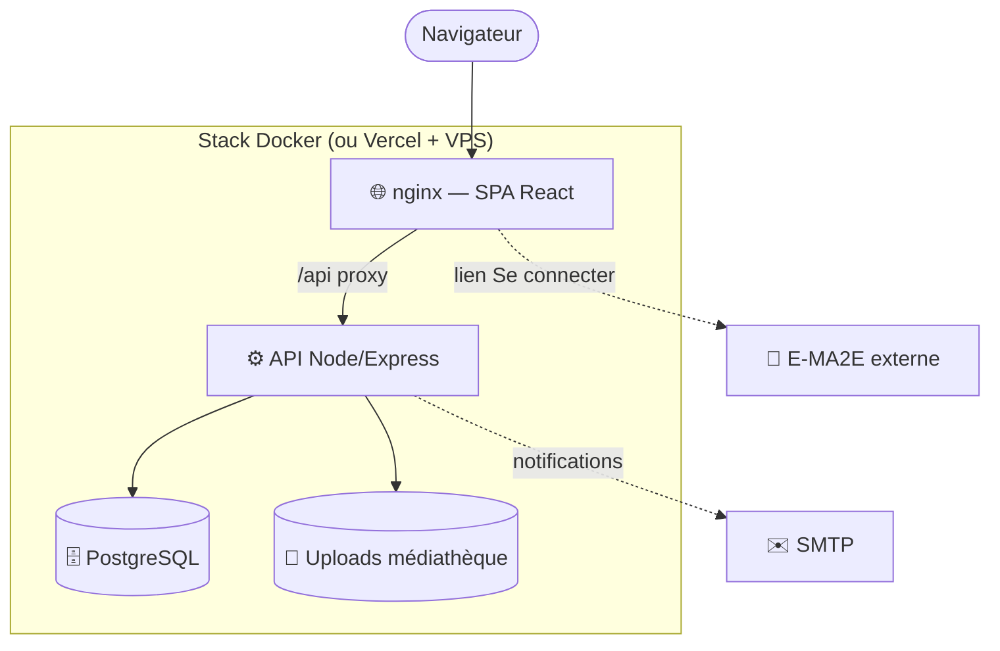

# Workflow de fonctionnement — Site MA2E

Ce document décrit comment fonctionne le site MA2E et clarifie le périmètre de chaque
brique (notamment la place de l'espace **E-MA2E**).

---

## 1. Le modèle à deux niveaux

| Niveau | Quoi | Acteur | Périmètre |
|--------|------|--------|-----------|
| **1 — Site institutionnel** | Vitrine publique + CMS + **pré-demandes** | Visiteur / Admin | ✅ Ce projet |
| **2 — E-MA2E** | Espace sociétaire **sécurisé** (solde, opérations) | Sociétaire connecté | 🔒 Plateforme séparée (existe déjà) |

Le site public ne manipule **aucune donnée bancaire sensible** : il informe, permet de
télécharger des formulaires et d'envoyer des **pré-demandes**. Les opérations réelles sur
le compte se font dans **E-MA2E** (niveau 2), vers lequel le site **renvoie**.

```mermaid
flowchart LR
  V([👤 Visiteur]):::actor --> SITE
  A([🛠️ Admin / Éditeur]):::actor --> BO
  S([🔐 Sociétaire]):::actor --> EMA2E

  subgraph SITE["🌐 Site institutionnel public (vitrine)"]
    direction TB
    P1[Accueil · À propos · Produits]
    P2[Actualités · FAQ · Médiathèque]
    P3[Pré-demandes en ligne]
  end

  subgraph BO["🛠️ Back-office (CMS)"]
    direction TB
    C1[Actualités · Produits · FAQ]
    C2[Médiathèque · Paramètres]
    C3[Demandes reçues]
    C4[Utilisateurs & rôles]
  end

  subgraph EMA2E["🔐 E-MA2E — espace sécurisé (séparé)"]
    direction TB
    E1[Solde & relevés]
    E2[Opérations en ligne]
    E3[Suivi épargne / crédits]
  end

  BO -- publie le contenu --> SITE
  SITE -- POST pré-demande --> BO
  SITE -. passerelle /espace-ema2e .-> EMA2E

  classDef actor fill:#1A6147,color:#fff,stroke:#0d3b2a;
```

---

## 2. Arborescence du site

---

## 3. Parcours principal : la pré-demande

Le **dossier complet** (pièces justificatives) se finalise **en agence** ou via **E-MA2E**.
Le site public assure uniquement la **pré-demande / prise de contact**.

---

## 4. Cycle de vie d'une demande

---

## 5. La boucle CMS (autonomie éditoriale)

> Tout contenu modifié dans le back-office (actualités, produits, FAQ, médias, paramètres)
> s'affiche **immédiatement** sur le site public, sans redéploiement.

---

## 6. Architecture de déploiement

---

## 7. Conclusion : la place de /espace-ema2e

`/espace-ema2e` **doit rester** sur le site public, mais en tant que **passerelle** :
- elle **présente** l'espace sociétaire et ses avantages,
- elle **renvoie** le sociétaire vers la vraie plateforme E-MA2E (sécurisée, séparée),
- elle **n'héberge pas** le login ni les données de compte (niveau 2, hors périmètre).

C'est le **point de jonction** entre le site vitrine (niveau 1) et l'espace sécurisé (niveau 2).

---

## 8. Faits sourcés sur E-MA2E (vérification documentaire)

> Vérification menée le 11/06/2026 sur les documents fournis, pour distinguer les faits
> avérés des hypothèses issues du contenu de démo.

**✅ Confirmé — Rapport annuel MA2E 2024** (citation) :
> « …la mise à disposition d'une solution **Web-Banking et Mobile-Banking**, dont le lancement
> est intervenu en **décembre 2022**. Nous enregistrons **2 824 souscriptions à l'application
> E-MA2E** pour une cible de 7 627 adhérents, soit un taux global d'adhésion de **37,03 %**. »

Donc E-MA2E est une solution **Web-Banking + Mobile-Banking** (⇒ **application mobile** existante),
lancée **déc. 2022**, ~2 824 utilisateurs (37 %).

**Autres sources :** un *Formulaire d'adhésion E-MA2E (PDF)* figure dans les documents fournis.

**❌ Hors périmètre de ce projet :**
- L'**appel d'offre (CDC AO-PSI-MA2E-2026-01)** ne mentionne **jamais** E-MA2E : il scope un
  **site institutionnel** (vitrine + CMS + téléchargement de formulaires + contact + Matomo + FR/EN).
- L'**offre technique Ebenyx** évoque seulement une architecture « **prête à accueillir** un espace
  sociétaire […] dès demain » (capacité **future**, sans nommer E-MA2E).

**⚠️ Non vérifié :** le tarif « **500 F/mois** » (issu du contenu de démo, absent des documents officiels).

**Conclusion :** E-MA2E **existe** mais sa construction **n'est pas** dans ce projet. La page
`/espace-ema2e` est conservée comme **passerelle** (présentation + futur lien vers l'app), sans
afficher d'information non sourcée.
